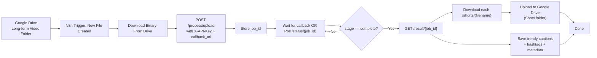

# ShortMaker - AI-Powered YouTube Shorts Generator

Convert long YouTube videos into viral short clips with AI-powered highlight detection, virality scoring, and automatic captions.


## ✨ Features

- 🤖 **AI-Powered Highlights** - Google Gemini AI finds the most viral-worthy moments
- 🏆 **Virality Scoring** - Each clip gets a 1-10 virality score
- ✍️ **AI Titles & Hooks** - Auto-generated catchy titles and scroll-stopping captions
- 🎬 **YouTube Download** - Paste any YouTube URL and download automatically
- 🎙️ **AI Transcription** - Uses OpenAI Whisper (local, free) for speech-to-text
- 📱 **Vertical Format** - Automatically crops and formats to 9:16 for TikTok/Reels/Shorts
- 📝 **Burned-in Captions** - Large, readable captions styled for mobile viewing
- 💰 **100% Free** - Gemini free tier (15 req/min), Whisper runs locally
- 🎯 **Face-Centered Shot Selection** - Optional face tracking pass prefers clips with clear, centered faces

## 🛠️ Prerequisites

### 1. Python 3.10+
Download from [python.org](https://www.python.org/downloads/)

### 2. FFmpeg
FFmpeg is required for video processing.

**Windows (using winget):**
```bash
winget install ffmpeg
```

**Verify installation:**
```bash
ffmpeg -version
```

### 3. Google Gemini API Key (Free)
Get your free API key from [Google AI Studio](https://aistudio.google.com/app/apikey)
- Free tier: 15 requests/min, 1M tokens/min
- No credit card required

### 4. (Optional) NVIDIA GPU with CUDA
For faster Whisper transcription.

## 🚀 Quick Start

### 1. Setup
```bash
cd shortmaker
python -m venv venv
.\venv\Scripts\Activate.ps1    # Windows PowerShell
pip install -r requirements.txt
cd frontend
npm install
```
> If you want face-tracking enabled, install OpenCV explicitly:
>
> ```bash
> pip install opencv-python-headless
> ```

### 2. Start the server
```bash
uvicorn backend.main:app --host 0.0.0.0 --port 8000
```

Copy `.env.example` to `.env` for local backend configuration. Secrets are read from environment variables first and persisted to `.env.json` only in encrypted form when `SHORTMAKER_SECRET_KEY` is set.

### React + Clerk setup

Clerk React quickstart: [https://clerk.com/docs/react/getting-started/quickstart](https://clerk.com/docs/react/getting-started/quickstart)

In `frontend/.env.local`:

```bash
VITE_CLERK_PUBLISHABLE_KEY=YOUR_PUBLISHABLE_KEY
# Optional: only set this when your API is on a different origin.
# Leave it unset for the default Vite proxy -> http://127.0.0.1:8000
# VITE_API_BASE_URL=http://127.0.0.1:8000
```

The app uses Clerk in `frontend/src/main.jsx` with `<ClerkProvider>` at the root and `frontend/src/App.tsx` uses `<Show>`, `<SignInButton>`, `<SignUpButton>`, and `<UserButton>`.

For split local frontend/backend development:

```bash
# Terminal 1 (backend)
uvicorn backend.main:app --host 127.0.0.1 --port 8000

# Terminal 2 (frontend)
cd frontend
npm run dev
```

Open `http://127.0.0.1:5173`.

By default, Vite proxies frontend API requests such as `/capabilities`, `/session`, and `/jobs/recent` to `http://127.0.0.1:8000`. Only set `VITE_API_BASE_URL` when you need to bypass that proxy and call a different backend origin directly.

If you are actively editing backend code, use `--reload` only for short test runs. A reload restarts the process and interrupts any in-flight transcription or video-generation job.

For local development on Windows, prefer the scoped reload runner so `watchfiles` does not restart the app on `venv/` or `.venv/` package changes:

```bash
python dev_server.py
```

### 3. Open in browser
Navigate to: **http://localhost:8000**

### 4. Configure AI (first time)
1. Click the **⚙️ AI Settings** button
2. Paste your Gemini API key
3. Click **Save & Enable AI**
4. You're ready! 🎉

## 🚀 Production Deployment (Docker + Render)

This repository includes production deployment files:

- `Dockerfile`
- `start.sh`
- `render.yaml`
- `docker-compose.yml`
- `.env.production.example`
- `requirements-local.txt` (optional local Whisper dependencies)

### Deploy with Docker (recommended)

```bash
cp .env.production.example .env.production
# edit .env.production and set real values
docker compose up --build -d
```

Open:

- `http://localhost:8000`

Health check:

```bash
curl http://localhost:8000/health
```

### Deploy to Render with one file

1. Push the repo to GitHub
2. Render > New > Blueprint > connect repo
3. Render will detect `render.yaml`
4. Set environment variables in dashboard (recommended):
   - `DATABASE_URL`
   - `VITE_CLERK_PUBLISHABLE_KEY`
   - `CLERK_ISSUER`
   - `SHORTMAKER_SECRET_KEY`
   - `SHORTMAKER_ADMIN_EMAILS`
   - `SHORTMAKER_ALLOWED_ORIGINS`
   - `SHORTMAKER_ALLOWED_HOSTS`
   - `YOUTUBE_CLIENT_ID`
   - `YOUTUBE_CLIENT_SECRET`
   - `YOUTUBE_REFRESH_TOKEN`
   - `GEMINI_API_KEY` (optional)
   - `GROQ_API_KEY` (optional)
5. Deploy

### Local Whisper (optional ASR fallback)

Default production install does not install Whisper locally (uses Groq first, then local fallback).

If you need local fallback:

```bash
python -m pip install -r requirements-local.txt
```

or in Docker image:

```bash
docker build --build-arg INSTALL_LOCAL_WHISPER=true -t shortmaker .
```

## 📖 How to Use

1. **Configure AI** - Click ⚙️ and enter your free Gemini API key
2. **Paste a YouTube URL** - Any public YouTube video (max 30 minutes)
3. **Select number of shorts** - Choose 1-10 clips to generate (automation defaults to 10)
4. **Click "Generate Viral Shorts"** - AI analyzes and picks the best moments
5. **Download your clips** - Each clip includes virality score, AI title, and hook caption

## 🤖 AI vs Rule-Based Detection

| Feature | Rule-Based (no API key) | AI-Powered (with Gemini) |
|---------|------------------------|--------------------------|
| Highlight Detection | Regex keyword matching | Deep content understanding |
| Clip Selection | Pattern scoring | Context-aware viral moment detection |
| Titles | Generic "Short #1" | AI-generated catchy titles |
| Hook Captions | None | Scroll-stopping hooks |
| Virality Score | Basic keyword count | AI-rated 1-10 scale |
| Quality | Good | Excellent |

## 📁 Project Structure

```
shortmaker/
├── backend/
│   ├── main.py           # FastAPI app & API routes
│   ├── ai_engine.py      # 🆕 Gemini AI integration
│   ├── video.py          # YouTube downloader (yt-dlp)
│   ├── transcription.py  # Whisper speech-to-text
│   ├── highlights.py     # AI + rule-based highlight detection
│   └── shorts.py         # Processing orchestration
├── frontend/
│   ├── index.html        # Vite entry HTML
│   ├── package.json      # React + Clerk frontend package manifest
│   ├── src/App.tsx       # Main application shell
│   ├── src/main.jsx      # React bootstrap + ClerkProvider
│   └── src/index.css     # Frontend styles
├── utils/
│   └── ffmpeg_helpers.py # Video processing utilities
├── outputs/              # Generated shorts (auto-created)
├── .env.example         # Local backend environment template
├── .env.json            # Encrypted runtime config (auto-created)
├── requirements.txt      # Python dependencies
└── README.md             # This file
```

## 🔧 API Endpoints

| Method | Endpoint | Description |
|--------|----------|-------------|
| POST | `/process` | Start video processing |
| POST | `/process/upload` | Upload and process a local video file (multipart/form-data) |
| GET | `/status/{job_id}` | Get processing status |
| GET | `/result/{job_id}` | Get final results with AI data |
| GET | `/api-keys` | List API keys (masked, admin only) |
| POST | `/api-keys` | Create API key (admin only) |
| DELETE | `/api-keys/{key_id}` | Revoke API key (admin only) |
| GET | `/auth/mode` | Get auth mode + requires-auth status |
| POST | `/auth/mode` | Set auth mode quick/production (admin only) |
| GET | `/shorts/{filename}` | Download a short clip |
| GET | `/shorts` | List all generated shorts |
| DELETE | `/shorts/{filename}` | Delete a short clip |
| DELETE | `/shorts` | Delete all shorts |
| **GET** | **`/ai/config`** | **Get AI configuration** |
| **POST** | **`/ai/config`** | **Save AI settings** |
| **POST** | **`/ai/validate`** | **Validate Gemini API key** |

## API for n8n (Headless Processing)

- `POST /process/upload`
  - `multipart/form-data`:
    - `file` (required): long-form video file
    - `num_clips` (optional): 1 to 10 (automation default = 10)
    - `callback_url` (optional): webhook URL to POST completion payload
    - `callback_token` (optional): value sent as custom callback header
    - `callback_auth_header` (optional): callback header name (default `X-Callback-Token`)
    - `callback_timeout_seconds` (optional): webhook timeout in seconds (1–120)
    - `public_base_url` (optional): public base URL used to build callback `short_urls`
  - returns `{ "job_id": "<uuid>", "message": "Upload processing started" }`
- poll `GET /status/{job_id}` until `stage=complete`
- fetch result from `GET /result/{job_id}` and read:
  - `shorts`: filenames
  - `short_urls`: direct API links
  - `ai_highlights[].trendy_caption`
  - `ai_highlights[].hashtags`
  - `ai_highlights[].face_score` (0-1)
  - `ai_highlights[].face_presence` (0-1)
  - `ai_highlights[].face_center_offset` (0 = center, higher = off-center)

## 🌐 API Authentication for Automation

ShortMaker can enforce API-key access for automation:

- Create an API key (server requires `SHORTMAKER_ADMIN_TOKEN` in env):
  - `POST /api-keys` with header `X-Admin-Token: <admin_token>`
  - body: `{ "name": "n8n-prod" }`
  - response returns one-time `api_key` and `id`
- Send one of these headers with automation requests:
  - `X-API-Key: <api_key>`
  - or `Authorization: Bearer <api_key>`
- Protected endpoints:
  - `POST /process`
  - `POST /process/upload`
  - `GET /status/{job_id}`
  - `GET /result/{job_id}`
  - `GET /shorts/{filename}`, `GET /shorts`
  - `DELETE /shorts*`

### Quick mode setup

- Default behavior:
  - `SHORTMAKER_AUTH_MODE` unset or `quick`
  - no API keys exist (`api_key_count = 0`)
  - `/process/*`, `/status/*`, `/result/*`, and `/shorts/*` do not require API key

```powershell
$env:SHORTMAKER_ADMIN_TOKEN = "your-admin-secret"
uvicorn backend.main:app --host 127.0.0.1 --port 8000
```

- Verify:

```powershell
Invoke-RestMethod http://127.0.0.1:8000/auth/mode
```

- Expected fields:
  - `requires_api_key: false`
  - `api_key_count: 0`
  - `admin_token_configured: true`

### Auth mode control

- Default mode is `quick`: endpoints are open while no keys exist.
- Set env `SHORTMAKER_AUTH_MODE=production` to force API-key enforcement always.
- New endpoints:
  - `GET /auth/mode` (returns current mode, key count, and enforcement state)
  - `POST /auth/mode` with body `{ "mode": "production" }` (admin only, `X-Admin-Token`)

### Production mode + API keys for n8n

1. Keep admin token configured in environment:

```powershell
$env:SHORTMAKER_ADMIN_TOKEN = "your-admin-secret"
$env:SHORTMAKER_AUTH_MODE = "production"
```

2. Create key:

```bash
curl -X POST http://127.0.0.1:8000/api-keys \
  -H "X-Admin-Token: your-admin-secret" \
  -H "Content-Type: application/json" \
  -d "{\"name\":\"n8n-automation\"}"
```

3. Send `X-API-Key` (or `Authorization: Bearer <api_key>`) from n8n for:
- `POST /process`
- `POST /process/upload`
- `GET /status/{job_id}`
- `GET /result/{job_id}`

## N8n Flow (Drive Folder -> Website API -> Drive Output Folder)



### Callback mode (preferred with n8n)

- include `callback_url` in `/process/upload` (point to an N8n webhook URL)
- N8n receives POST payload:
  - `job_id`, `status`, `success`, `event`, `shorts`, `short_urls`, `ai_highlights`
- On success callback, N8n downloads `shorts` and uploads directly to target folder (no polling required)

## ⚙️ Configuration

### AI Model Options

| Model | Speed | Free Tier |
|-------|-------|-----------|
| **gemini-2.0-flash** | ⚡ Fastest | ✅ Yes (default) |
| gemini-2.0-flash-lite | ⚡ Fast | ✅ Yes |
| gemini-1.5-flash | ⚡ Fast | ✅ Yes |

### Whisper Model Size

Edit `backend/transcription.py` to change:

| Model | Size | Speed | Accuracy |
|-------|------|-------|----------|
| tiny | 39M | Fastest | Basic |
| **base** | 74M | Fast | Good (default) |
| small | 244M | Medium | Better |
| medium | 769M | Slow | High |

## 🐛 Troubleshooting

### "FFmpeg not found"
Ensure FFmpeg is installed and in your PATH.

### "AI detection returned no results"
- Check your Gemini API key is valid
- The app falls back to rule-based detection automatically

### "Rate limited"
You've exceeded the free tier (15 req/min). Wait a minute and retry.

### "No highlights detected"
The video may be too short or have minimal speech.

## 📄 License

MIT License - feel free to use, modify, and distribute.

## 🙏 Credits

- [Google Gemini](https://ai.google.dev/) - AI-powered analysis
- [yt-dlp](https://github.com/yt-dlp/yt-dlp) - YouTube downloading
- [OpenAI Whisper](https://github.com/openai/whisper) - Speech-to-text
- [FFmpeg](https://ffmpeg.org/) - Video processing
- [FastAPI](https://fastapi.tiangolo.com/) - Web framework

---

Built with ❤️ for creators who want to repurpose content without expensive tools.
